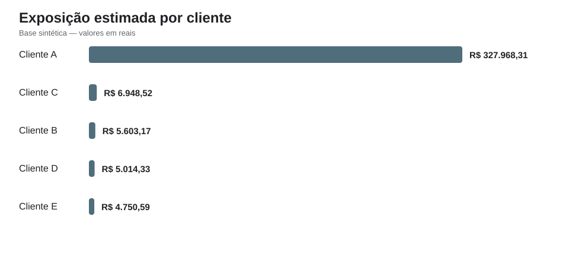
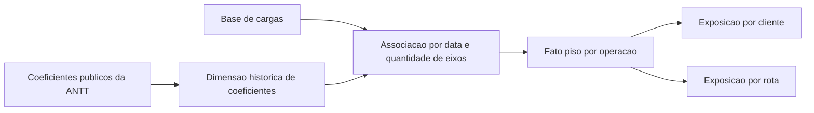

# Verificação de aderência ao piso mínimo de frete (ANTT)

Ferramenta de análise que verifica se operações de transporte rodoviário de
carga estão enquadradas no piso mínimo de frete da ANTT, aplicando a fórmula
oficial e respeitando a vigência da norma na data de cada operação.



## Por que isso importa

O transporte rodoviário de carga lotação está sujeito a um piso mínimo de
frete, definido pela Política Nacional de Pisos Mínimos do Transporte
Rodoviário de Cargas (Lei nº 13.703/2018) e regulamentado pela ANTT. Contratar
frete abaixo do piso expõe a empresa a autuações.

Historicamente, esse controle era **reativo**: a operação acontecia e a
verificação vinha depois, por fiscalização. Em 2026 essa lógica se inverteu. A
Medida Provisória nº 1.343/2026 e sua regulamentação pela ANTT passaram a
condicionar a própria existência da operação ao cumprimento do piso:

- a **Resolução ANTT nº 6.078/2026** (vigente desde 24/05/2026) regulamenta o
  cadastro da operação de transporte e determina que o CIOT só pode ser gerado
  se o valor do frete respeitar o piso mínimo, com o número vinculado ao MDF-e;
- a **Resolução ANTT nº 6.077/2026** estrutura as penalidades, com progressão
  de sanções e suspensão do RNTRC para quem contrata abaixo do piso de forma
  reiterada.

Sem CIOT, a operação não se formaliza. O controle saiu da fiscalização
posterior para o momento da contratação.

Este projeto implementa, do lado de quem contrata, exatamente esse tipo de
verificação na origem: calcular o piso correto e sinalizar operações fora da
regra **antes** que o problema exista. É a mesma lógica de um controle
preventivo — próxima, em natureza, de detecção de anomalias ou prevenção de
fraude, onde o dado serve para barrar o problema antes do dano, e não para
remediá-lo depois.

## A dificuldade central

A verificação não pode usar apenas a tabela de coeficientes mais recente.

A ANTT atualiza periodicamente os coeficientes de deslocamento e de carga e
descarga. Cada operação precisa ser avaliada pela norma **vigente em sua
própria data**. Aplicar a tabela atual a uma operação de meses atrás produz
piso errado, para mais ou para menos.

A base de demonstração cobre o período de **1º de agosto de 2025 a 31 de março
de 2026**, que atravessa três vigências reais:

- Resolução ANTT nº 6.067/2025, a partir de 18/07/2025;
- Resolução ANTT nº 6.076/2026, a partir de 20/01/2026;
- Portaria SUROC nº 3/2026, a partir de 13/03/2026.

O núcleo técnico do projeto é resolver essa vigência por data e associar cada
operação ao coeficiente correto.

## Como funciona



## Regra de cálculo

Para o escopo implementado — **Tabela A, Carga Geral, contratação da composição
veicular** — o piso é calculado por:

```text
piso = distancia em km x coeficiente de deslocamento (CCD)
       + coeficiente de carga e descarga (CC)
```

A base de comparação é o **frete sem ICMS**, pois o piso ANTT remunera o valor
pago ao contratado. A coluna `exposicao` representa o valor que faltaria para a
operação alcançar o piso:

```text
exposicao = maximo(piso calculado - frete praticado, 0)
```

A coluna `diferenca` preserva o sinal analítico: negativa indica operação
abaixo do piso, positiva indica operação acima.

## Modelagem temporal

O script `01_dim_coeficiente_vigencia.sql` usa `LEAD` para fechar a vigência de
cada coeficiente no dia anterior ao início da norma seguinte.

A tabela `fato_piso` mantém a granularidade da operação individual e registra
carga e data, cliente e rota, distância e eixos, frete praticado, norma e
coeficientes aplicados, piso calculado, diferença, exposição e situação. Assim
qualquer linha pode ser auditada até a norma e a fórmula que a geraram.

## O que a demonstração mostra

A execução reproduzível roda sobre 900 cargas **sintéticas**, geradas com
semente fixa apenas para demonstrar o funcionamento. Os números abaixo são,
portanto, artificiais e servem só para ilustrar as saídas da ferramenta.

O pipeline produz, a partir do `fato_piso`:

- um panorama geral (quantas operações abaixo do piso e exposição somada);
- a distribuição da exposição por cliente;
- o detalhamento por rota dentro de cada cliente.

Esse recorte — exposição por rota **dentro** de cada cliente — é o que torna
possível distinguir um problema pontual de precificação de uma falha
distribuída, algo que o total agregado por cliente esconde.

Resultados exportados:

- [`resultados/resumo_geral.csv`](resultados/resumo_geral.csv)
- [`resultados/resultado_por_cliente.csv`](resultados/resultado_por_cliente.csv)
- [`resultados/resultado_por_rota.csv`](resultados/resultado_por_rota.csv)
- [`resultados/amostra_fato_piso.csv`](resultados/amostra_fato_piso.csv)

## Como reproduzir

Pré-requisito: **Python 3.10 ou superior**. Sem dependências externas.

```bash
git clone https://github.com/rodrigoribeirodata/analise-piso-minimo-antt.git
cd analise-piso-minimo-antt
python python/executar_pipeline.py
```

O comando gera as cargas sintéticas, cria um banco SQLite local, carrega cargas
e coeficientes públicos, executa os scripts SQL na ordem, valida que toda carga
recebeu uma vigência, exporta os resultados em CSV e atualiza o gráfico.

## Estrutura do repositório

```text
.
├── dados/
│   ├── antt/coeficientes_antt.csv     coeficientes publicos da ANTT
│   └── sintetico/cargas.csv           base de demonstracao gerada
├── imagens/
│   └── exposicao_por_cliente.svg
├── python/
│   ├── gerar_base_sintetica.py
│   └── executar_pipeline.py
├── resultados/                        saidas geradas pelo pipeline
└── sql/
    ├── 01_dim_coeficiente_vigencia.sql
    ├── 02_calcula_piso.sql
    └── 03_analise_exposicao.sql
```

## Stack e competências demonstradas

- Python com biblioteca padrão para geração, ingestão, validação e exportação;
- SQL e modelagem temporal de vigência com `LEAD`;
- SQLite para execução reproduzível sem dependências;
- modelagem analítica em granularidade transacional;
- leitura de norma regulatória traduzida em regra de cálculo e código;
- análise de concentração por dimensão (cliente, rota);
- lógica de controle preventivo aplicada a dado transacional.

## Limitações do escopo

Esta implementação cobre somente: Tabela A, tipo Carga Geral, composições de 5,
6, 7 e 9 eixos, comparação com o frete sem ICMS, e base sintética sem pedágio,
retorno vazio e demais componentes fora do cálculo apresentado.

É uma demonstração analítica e não substitui avaliação jurídica, fiscal ou
regulatória de uma operação real.

## Fontes oficiais

- [Lei nº 13.703/2018 — Política Nacional de Pisos Mínimos](https://www.planalto.gov.br/ccivil_03/_ato2015-2018/2018/lei/l13703.htm)
- [Resolução ANTT nº 5.867/2020 — metodologia e regras gerais](https://anttlegis.antt.gov.br/action/UrlPublicasAction.php?acao=abrirAtoPublico&cod_modulo=161&num_ato=00005867&seq_ato=000&sgl_orgao=DG%2FANTT%2FMI&sgl_tipo=RES&vlr_ano=2020)
- [Resolução ANTT nº 6.067/2025](https://anttlegis.antt.gov.br/action/ActionDatalegis.php?acao=abrirTextoAto&cod_menu=9230&cod_modulo=623&numeroAto=00006067&orgao=DG%2FANTT%2FMT&seqAto=000&tipo=RES&valorAno=2025)
- [Resolução ANTT nº 6.076/2026](https://anttlegis.antt.gov.br/action/ActionDatalegis.php?acao=abrirTextoAto&cod_menu=9230&cod_modulo=623&numeroAto=00006076&orgao=DG%2FANTT%2FMT&seqAto=000&tipo=RES&valorAno=2026)
- [Portaria SUROC nº 3/2026 — reajuste de coeficientes de março de 2026](https://anttlegis.antt.gov.br/action/ActionDatalegis.php?acao=abrirTextoAto&cod_menu=7782&cod_modulo=421&link=S&numeroAto=00000003&orgao=SUROC%2FANTT%2FMT&seqAto=000&tipo=POR&valorAno=2026)
- [Resolução ANTT nº 6.077/2026 — penalidades e suspensão do RNTRC](https://www.in.gov.br/web/dou/-/resolucao-antt-n-6.077-de-24-de-marco-de-2026-695432497)
- [Resolução ANTT nº 6.078/2026 — cadastro da operação e vínculo do CIOT ao piso (vigente desde 24/05/2026)](https://www.in.gov.br/web/dou/-/resolucao-antt-n-6.078-de-24-de-marco-de-2026-695432632)
- [Perguntas frequentes da ANTT sobre piso mínimo e CIOT](https://www.gov.br/antt/pt-br/assuntos/cargas/ciot-para-todos-1/perguntas-frequentes)

---

> Dados de cargas sintéticos, gerados apenas para demonstrar o funcionamento da
> ferramenta. O projeto implementa uma metodologia de verificação sobre dados
> públicos da ANTT e não representa nenhuma operação específica.
